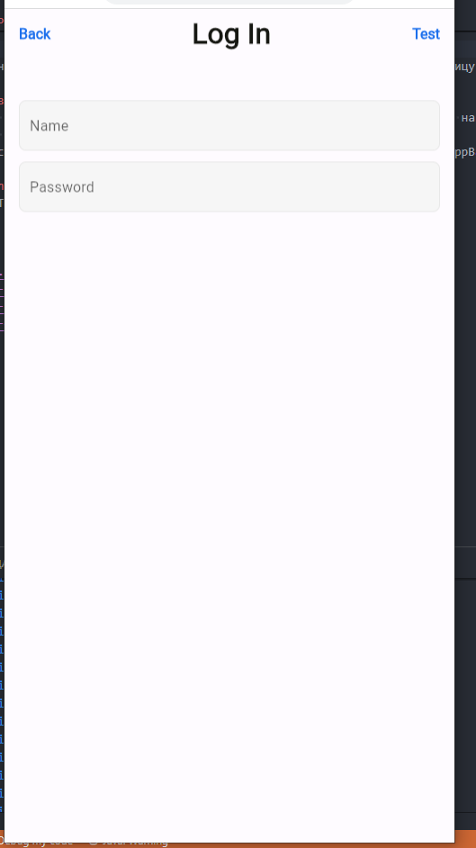
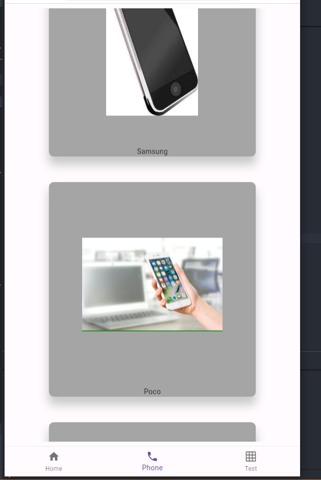
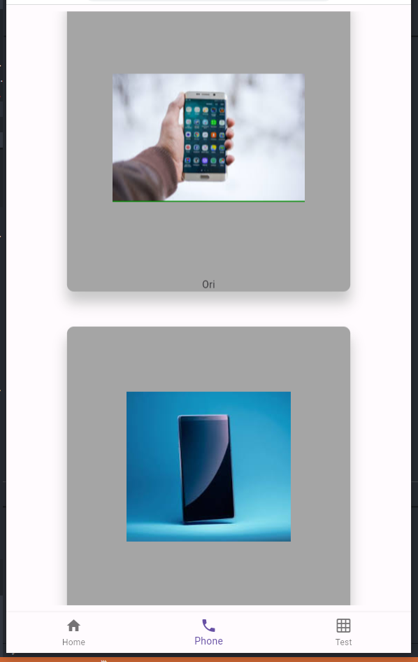

# mobix

Приложение с листами телефонов.

## Виджет PhoneItem

Был создан виждет для настройки и рендера будучи в `PhoneList`. Принимает в себя 2 параметра `phoneName` и `phoneSrc` соответственно.

```dart
class PhoneItem extends StatelessWidget {
  final String phoneSrc;
  final String phoneName;
  const PhoneItem({super.key, required this.phoneName, required this.phoneSrc});
  @override
  Widget build(BuildContext context) {
    return Align(
        alignment: Alignment.center,
        child: Container(
          width: MediaQuery.of(context).size.width * 0.7,
          decoration: CustomCardTheme.cardDecoration,
          child: Column(children: <Widget>[
            ClipRect(
              child: Container(
                constraints: const BoxConstraints(
                  minHeight: 400,
                  maxHeight: 600,
                ),
                child: Image.network(phoneSrc),
              ),
            ),
            Text(phoneName)
          ]),
        ));
  }
}

```
Так же для карточки был сделал класс с настройкой его дизайна папка с дизайном находится в пути `/lib/app/app_theme.dart`
## Виджет PhoneList

Для того чтобы можно было рендерить карточки `phoneItems` был использован `ListView` с методом `separated` что-бы добавить отступ между карточками. Принимает в себя массив классов `List<Phones>` сам класс описан следующем образом:

```dart
class Phones {
  String imgSrc;
  String phoneName;
  Phones({required this.imgSrc, required this.phoneName});
}

```
Массив описан в том же виджете, виджет передает данные с массива в дочерний кастомный виджет `PhoneItem`.
```dart 

class PhoneList extends StatelessWidget {
  final List<Phones> phones;
  const PhoneList({super.key, required this.phones});
  @override
  Widget build(BuildContext context) {
    return ListView.separated(
        separatorBuilder: (BuildContext context, int index) {
          return SizedBox(height: 50);
        },
        itemCount: phones.length,
        itemBuilder: (BuildContext context, int index) {
          return PhoneItem(
            phoneName: phones[index].phoneName,
            phoneSrc: phones[index].imgSrc,
          );
        });
  }
}

```
# Результат 


