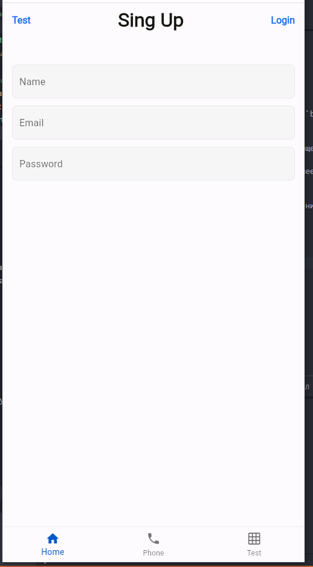

# mobix

Приложение с листами телефонов.

## Виджет PhoneItem

Был создан виждет для настройки и рендера будучи в `PhoneList`. Принимает в себя 2 параметра `phoneName` и `phoneSrc` соответственно.

```dart
class PhoneItem extends StatelessWidget {
  final String phoneSrc;
  final String phoneName;
  final double phonePrice;
  final String phoneDesc;
  const PhoneItem(
      {super.key,
      required this.phoneName,
      required this.phoneSrc,
      required this.phoneDesc,
      required this.phonePrice});
  @override
  Widget build(BuildContext context) {
    return InkWell(
      onTap: () {
        Navigator.push(
          context,
          MaterialPageRoute(
            builder: (context) => PhoneDetailScreen(
              phoneName: phoneName,
              phoneSrc: phoneSrc,
              phoneDesc: phoneDesc,
              phonePrice: phonePrice,
            ),
          ),
        );
      },
      child: Align(
          alignment: Alignment.center,
          child: Container(
            width: MediaQuery.of(context).size.width,
            decoration: CustomCardTheme.cardDecoration,
            child: Row(
                crossAxisAlignment: CrossAxisAlignment.start,
                children: <Widget>[
                  ClipRect(
                    child: Container(
                      margin: const EdgeInsets.only(right: 16),
                      decoration: BoxDecoration(
                          color: AppTheme.sceletonBackground,
                          borderRadius: BorderRadius.circular(8)),
                      height: 65,
                      width: 65,
                      child: Image.network(phoneSrc),
                    ),
                  ),
                  Expanded(
                    child: Column(
                      mainAxisAlignment: MainAxisAlignment.start,
                      children: <Widget>[
                        Padding(
                          padding: const EdgeInsets.only(bottom: 8),
                          child: Row(
                            children: <Widget>[
                              Text(
                                "$phoneName",
                                style: TextStyles.headlineSmall,
                              ),
                              Spacer(),
                              Text(
                                "$phonePrice\$",
                                style: TextStyles.subtitle,
                              ),
                            ],
                          ),
                        ),
                        Align(
                          alignment: Alignment.centerLeft,
                          child: Text(
                            "$phoneDesc",
                            style: TextStyles.body,
                          ),
                        )
                      ],
                    ),
                  )
                ]),
          )),
    );
  }
}


```

Так же для карточки был сделал класс с настройкой его дизайна папка с дизайном находится в пути `/lib/app/app_theme.dart`

## Виджет PhoneList

Для того чтобы можно было рендерить карточки `phoneItems` был использован `ListView` с методом `separated` что-бы добавить отступ между карточками. Принимает в себя массив классов `List<Phones>` сам класс описан следующем образом:

```dart
class Phones {
  String imgSrc;
  String desc;
  double price;
  String phoneName;
  Phones(
      {required this.imgSrc,
      required this.phoneName,
      required this.price,
      this.desc = "Дефолтное описание для элементов у которых нету описания."});
}
```

Массив описан в этом же файле с классом `Phones`

```dart

class PhoneList extends StatelessWidget {
  final List<Phones> phones;
  const PhoneList({super.key, required this.phones});
  @override
  Widget build(BuildContext context) {
    return ListView.separated(
        separatorBuilder: (BuildContext context, int index) {
          return const Divider(
            height: 33,
            color: AppTheme.dividerColor,
          );
        },
        itemCount: phones.length,
        itemBuilder: (BuildContext context, int index) {
          if (phones.isEmpty) {
            return const Center(
              child: Text("Телефонов нету"),
            );
          } else {
            return PhoneItem(
              phoneName: phones[index].phoneName,
              phoneSrc: phones[index].imgSrc,
              phoneDesc: phones[index].desc,
              phonePrice: phones[index].price,
            );
          }
        });
  }
}
```
## Страница для `PhoneItems`
При нажатии на `IncWell` на страницу передаются все данные из того же массива. Данные которые принимает в себя `PhoneDetailScreen`
```dart 
class PhoneDetailScreen extends StatelessWidget {
  final String phoneName;
  final String phoneSrc;
  final String phoneDesc;
  final double phonePrice;
  const PhoneDetailScreen(
      {super.key,
      required this.phoneDesc,
      required this.phoneName,
      required this.phonePrice,
      required this.phoneSrc});
  //...
}
```
В `appBar` сделайн еще один `IncWell` с надписью `back` которая возвращяет на страницу листов всех телефонов.

# Страницы авторизации 
Страница временно находться на `HomePage` в будующем будет зарефакторена, и разбита на компоненты так же как и `LoginPage`.
## Страница `Sing up`
Создана страница с тремя `TextField` последний имеет скрытие вводимого пароля, в `appBar` находится ссылка на переход к `LoginPage`. В будующем будут созданны компоненты кнопок для двух этих страниц.
## Страница `Login`
Состоит из двух `TextField` имеет кнопку возвращения к регистрации.


# Результат



